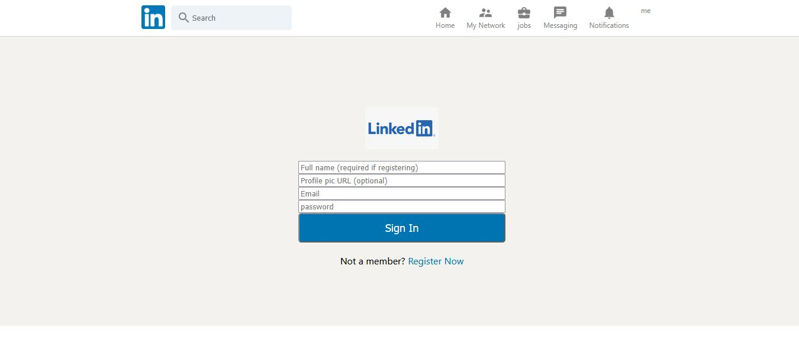
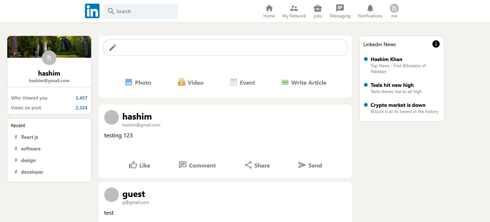

# LinkedIn Clone

A React-based LinkedIn-style social app built as a front-end practice project. It includes a polished UI with authentication, a post feed, and a sidebar/widgets layout inspired by LinkedIn.

## Features

- User authentication with Firebase Auth
  - Sign in with email and password
  - Register a new account
- Personalized app experience
  - Displays the signed-in user's profile information
  - Supports profile picture and display name
- Post feed
  - Create new posts from the main feed
  - View posts in real time from Firestore
  - Smooth animated post rendering with React Flip Move
- LinkedIn-inspired UI
  - Header with navigation-style actions
  - Sidebar with profile overview
  - Widgets section for additional content

## Tech Stack

- React.js
- Redux Toolkit
- Firebase Authentication
- Cloud Firestore
- Material UI icons
- CSS for styling

## Project Structure

- src/App.js - Main app layout and auth state handling
- src/Feed.js - Post creation and feed rendering
- src/Login.js - Authentication UI for sign in and registration
- src/Firebase.js - Firebase configuration and service setup
- src/features/userSlice.js - Redux slice for user state

## Getting Started

1. Clone the repository
   ```bash
   git clone <repository-url>
   cd linkedin-clone
   ```

2. Install dependencies
   ```bash
   npm install
   ```

3. Start the development server
   ```bash
   npm start
   ```

4. Open http://localhost:3000 to view the app in your browser

## Available Scripts

- npm start - Runs the app in development mode
- npm run build - Builds the app for production
- npm test - Launches the test runner

## Screenshots





## Notes

This project uses Firebase for authentication and post storage. If you want to use your own backend, update the Firebase configuration in src/Firebase.js.
